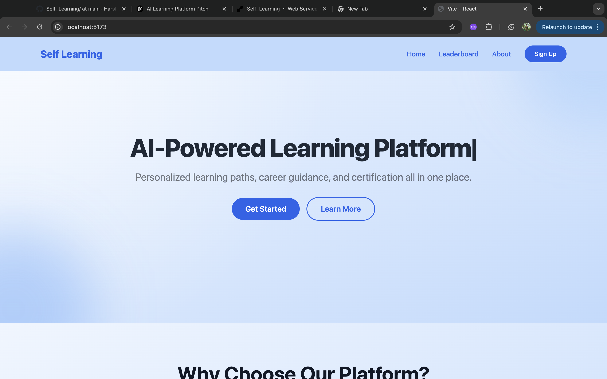
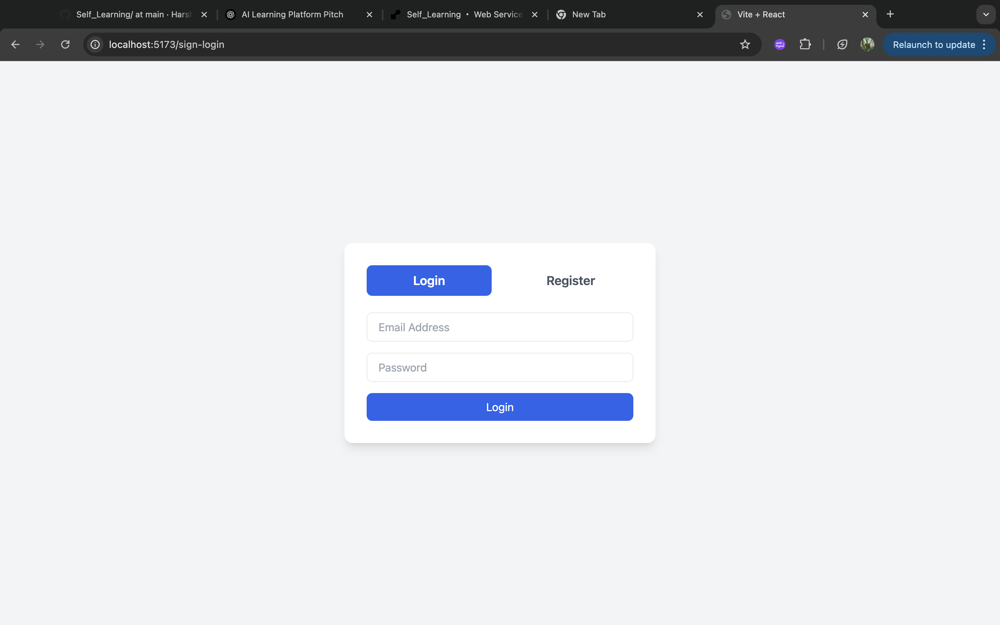
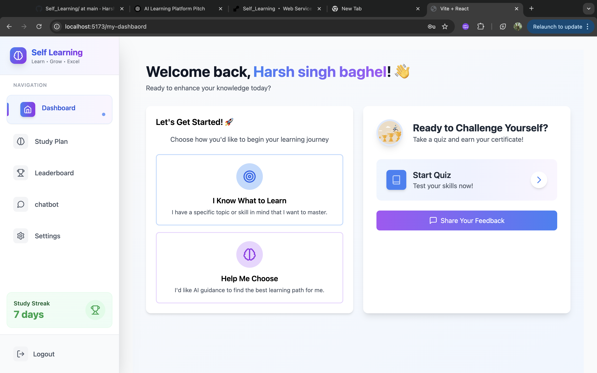
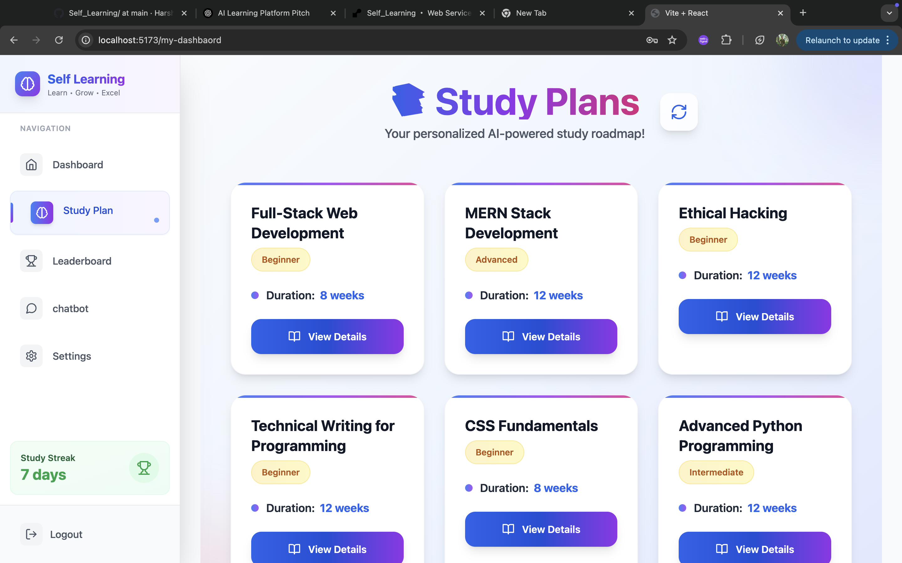
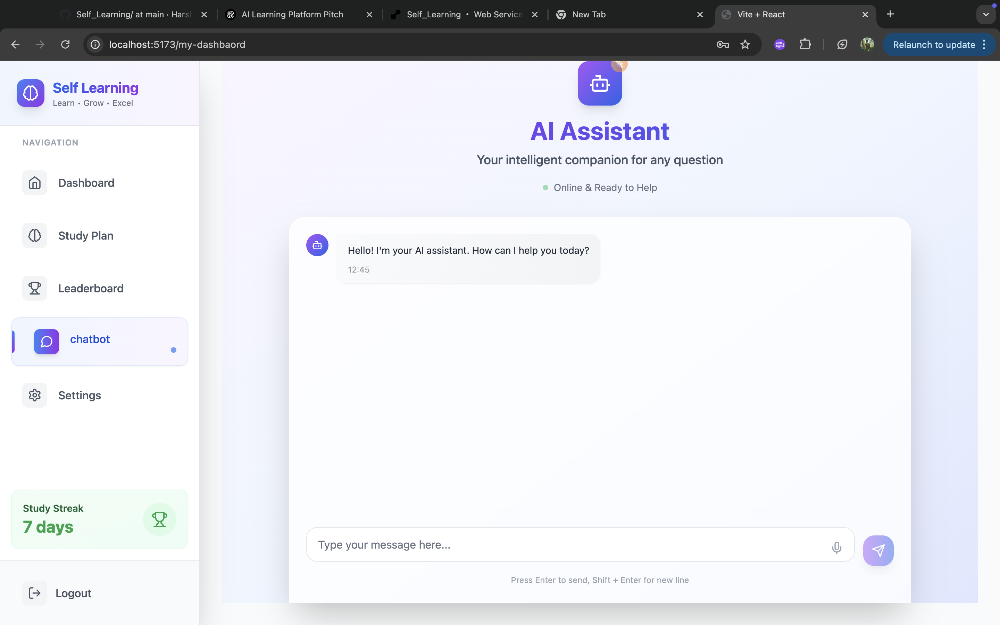

# 🚀 AI-Powered Self-Learning Platform  




> An intelligent, personalized AI learning platform built using the MERN stack that adapts to your learning needs, tracks your growth, and motivates you to succeed.

---

## 🧩 Problem Statement

> In today's fast-paced world, learners are often overwhelmed by too much content, confused about where to begin, or unsure of what suits their goals.  
> Most existing platforms assume users already know what they want to learn.  
> But in reality, many students need **guidance, structure, and motivation** — and that’s what this platform delivers.

This project solves real-world learning challenges by offering a smart dashboard that supports both **clear learners** and **confused learners**, ensuring everyone gets a personalized journey powered by AI.

---

## 🌟 Key Features

- 🤖 **AI Learning Guidance** — Get help choosing the right study path based on your interests.
- 📆 **Personalized Study Plans** — Weekly structured plans auto-generated by AI.
- 📊 **Quizzes & Performance Analysis** — Test yourself with AI-generated quizzes and real-time feedback.
- 🧠 **Weakness Detection & Improvement** — Track weak areas and get suggested resources.
- 🏆 **Leaderboard & Certificates** — Earn points and certificates to stay motivated.
- 🧑‍🤝‍🧑 **Referral System** — Invite friends, earn rewards, and grow together.
- 📋 **Smart Dashboard** — View study plans, progress, and recommendations in one place.
- 💬 **AI Chatbot Assistant** — Ask doubts, get answers, and receive career guidance in real-time.

---

## 📸 Screenshots


### 🔐 Login & Signup


### 🧠 Dashboard (Learner Type Selection)


### ✅ Clear Learner Flow — Form & Study Plan


### ❓ Confused Learner Flow — AI Suggestions


---

## 🛠️ Tech Stack

- **Frontend** – React.js + Tailwind CSS  
- **Backend** – Node.js, Express.js  
- **Database** – MongoDB  
- **AI Integration** – Gemini / OpenAI API (for personalized logic)  
- **Authentication** – JWT  
- **Hosting** – (add if hosted: e.g., Vercel / Render)

---

## 🧪 How to Run Locally

```bash
# 1. Clone the repo
git clone https://github.com/Harsh231075/Self_Learning

# 2. Go into the project directory
cd ai-learning-platform

# 3. Install dependencies
npm install && cd Frontend && npm install

# 4. Add your .env file for backend
# Example: MONGO_URI, JWT_SECRET, AI_API_KEY

# 5. Run both backend and frontend
npm run dev

